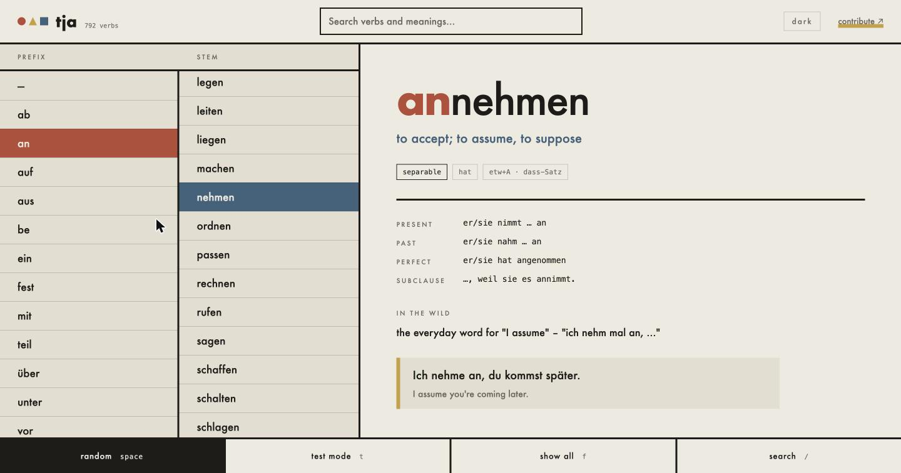
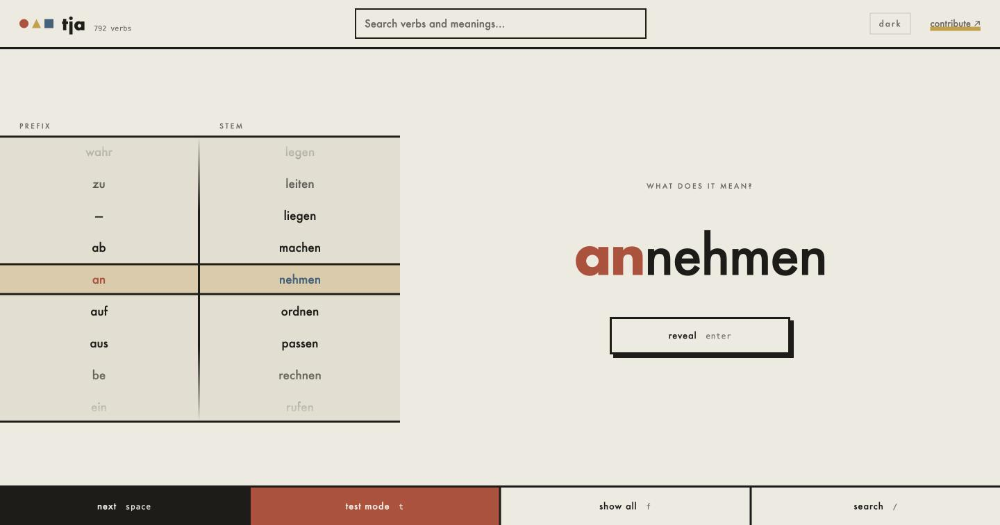

# tja

German prefix verbs, in a browser. Two columns — prefixes and stems — that
filter each other, so every pair you can land on is a real word. Pick one and
the card tells you what it means, where the prefix goes in each tense, and how
the verb is actually used.

Test mode turns the same two columns into a one-armed bandit: pull the handle,
the reels spin, you get a verb and one question — what does it mean?

Bauhaus by way of brutalism: paper, heavy rules, blocks of flat colour, and
Futura where the machine has it. Light and dark, following the system
preference until you say otherwise.

792 verbs across 90 stems. It is the web version of
[the terminal app](https://github.com/progapandist/tja), sharing its data file.





## Running it

```sh
bun run dev    # http://localhost:3000, reloads when a file changes
bun test
```

Needs Bun 1.2 or newer (the test runner's DOM does not work on older ones).

## What it is made of

Nothing. `index.html`, `style.css`, and two ES modules the browser loads
directly. No framework, no bundler, no transpiler, no CSS library, no build
step — the file you edit is the file the browser runs. The only dependency is
jsdom, and only so the tests can click things.

| File | |
|---|---|
| `verbs.txt` | the data: one line per verb, pipe-delimited, hand-editable |
| `data.js` | parses it, derives the verb forms, ranks the search |
| `app.js` | the two columns, the card, the reels |
| `style.css` | |
| `server.js` | dev server with live reload, about thirty lines |

Grammar that can be derived is derived, never stored. A separable prefix hops
to the end of the clause (`nimmt … an`) and takes the `ge-` with it
(`angenommen`); an inseparable one stays put and drops the `ge-`
(`übernommen`). Both come from the same stem entry.

## Adding verbs

Append to `verbs.txt`. A line starting with `=` opens a stem and carries its
principal parts; the lines under it are the prefixed verbs.

```
=stem|gloss|präsens 3.sg|präteritum|partizip II|aux
verb|separable t/f|official|colloquial|example|use|example in English|aux override
```

## Keys

| | |
|---|---|
| `space` | random verb — or the next card, in test mode |
| `t` | test mode |
| `f` | show every prefix and stem, dimming the pairs that are not words |
| `/` | search, umlauts optional: `uber` and `ueber` both find `übernehmen` |
| `enter` | reveal the meaning |
| arrows, `j` `k` | move the columns — up and down the stems, left and right the prefixes |

The columns are listboxes you can tab into, search is a proper combobox with
arrow-key results, every control has a visible focus ring, and a spin respects
`prefers-reduced-motion`.

Everything a key does, a tap does too: the columns scroll and take taps, the
reels can be flicked, and the footer buttons are the whole keyboard.

## Deploying

Cloudflare Pages, with DNS staying at DigitalOcean. Setup is a handful of
one-off commands (see the project's deploy notes); after that it is:

```sh
make deploy    # runs the tests, then publishes
```

Cloudflare now recommends Workers Static Assets over Pages for new projects.
Pages is used here for one reason: Workers Custom Domains require the zone to
be hosted on Cloudflare, and this domain's nameservers are at DigitalOcean.
If the zone ever moves, switching is a `wrangler.jsonc` with an `assets`
directory and a `custom_domain` route — and `wrangler deploy` then handles the
DNS record and the certificate itself.

Worth having wherever this is served: gzip (`verbs.txt` is 140 KB of text and
compresses to about a quarter of that) and a long `Cache-Control` on `.js` and
`.css` with a short one on `index.html`. Pages does both by default.
